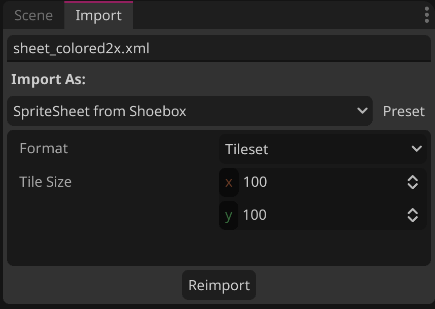

# godot-shoebox-importer
A Godot 4 Spritesheet &amp; Tileset importer for Shoebox XML.

Based upon the work of https://github.com/gustavopateti/godot-xml-spritesheet-importer, a 3.5+ importer.

# Installation
To add to your Godot 4+ project: 

1. Download and drop the entire `binarysolo.shoebox` folder into `res://addons`.
2. Open Project Settings and go to the Plugins tab.
3. Enable the plugin!
	Note: Sometimes you may need to reload the current project for plugins to work correctly.

# Importing Sprites
There are two different types of imports for sprites: Spritesheet and Tilemap. To import both: 

1. Place the shoebox xml file next to the sprite. They should share a name with the extension (.png / .xml) being the only difference. 
2. With the plugin enabled and correctly recognized, select a shoebox xml file and open the Import tab. From the dropdown, select the Shoebox XML importer.

4. Select from Tiles or Spritesheet. Tiles work with Godot 4's Tilemap and create a tilemap. Spritesheet will create each image as it's own usable sprite in a subfolder of the current location.
5. Hit Reimport.